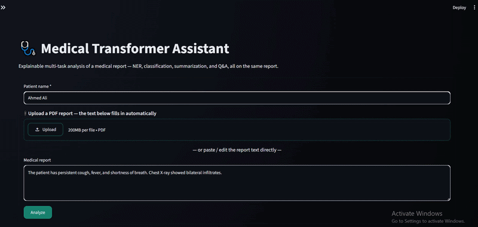

# Medical Transformer Assistant

**Explainable multi-task NLP for medical reports** — entity extraction, disease-category classification, summarization, and Q&A, all powered by transformer models and paired with built-in explainability (word importance, counterfactual testing) and one-click clinical/patient PDF exports.

Built with [Streamlit](https://streamlit.io/) and [🤗 Transformers](https://huggingface.co/docs/transformers/index).

> ⚠️ **This is a decision-support and educational tool, not a diagnostic device.** All AI outputs are model predictions, not clinical diagnoses. See [Disclaimer](#-disclaimer).

---

## ✨ Features

- **📎 Flexible input** — paste report text directly, or upload a PDF report and let the app extract the text automatically.
- **① Understand** — biomedical Named Entity Recognition (NER), grouped into clinically meaningful buckets: *Symptoms*, *Imaging Findings*, *Diagnostic Procedures*, *Other Clinical Mentions*.
- **② Classify** — zero-shot classification of the report into a disease category, with a full score breakdown across all candidate categories.
- **③ Explain** — word-importance (occlusion-based) explainability showing which words most influenced the AI's classification, plus an optional **Advanced Analysis → Counterfactual** panel for testing "what if this phrase were removed?" style questions.
- **④ Clinical Summary** — abstractive summarization of the report.
- **⑤ Q&A** — ask free-form questions about the report and get extractive answers with a confidence score.
- **Two report modes**
  - **Clinical / Doctor** — full technical view: entities, model scores, explainability, optional counterfactual analysis, summary, Q&A.
  - **Patient-Friendly** — a plain-language summary with no technical AI jargon, plus a clear medical disclaimer.
- **📄 One-click PDF export** — generates a polished PDF matching the selected mode. The counterfactual section only appears in the PDF if the clinician explicitly runs it and opts to include it.

---

## 🎬 Demo



*A quick walkthrough of the app: uploading/pasting a report, running Analyze, and stepping through Understand → Classify → Explain → Summary → Q&A, ending with a PDF export.*

---

## 🧠 How it works

| Step | Task | Model |
|---|---|---|
| Understand | Biomedical Named Entity Recognition | [`d4data/biomedical-ner-all`](https://huggingface.co/d4data/biomedical-ner-all) |
| Classify | Zero-shot text classification | [`facebook/bart-large-mnli`](https://huggingface.co/facebook/bart-large-mnli) |
| Explain | Occlusion-based word importance | Derived from the classifier above |
| Explain (advanced) | Counterfactual analysis | Derived from the classifier above |
| Summarize | Abstractive summarization | [`sshleifer/distilbart-cnn-12-6`](https://huggingface.co/sshleifer/distilbart-cnn-12-6) |
| Q&A | Extractive question answering | [`deepset/roberta-base-squad2`](https://huggingface.co/deepset/roberta-base-squad2) |

Candidate disease categories used for classification (configurable in `app.py`):

```
Respiratory disease · Cardiovascular disease · Gastrointestinal disease
Neurological disease · Infectious disease
```

### Explainability

- **Word importance (occlusion):** each word in the report is temporarily removed, and the drop in the classifier's confidence for the predicted category measures that word's contribution.
- **Counterfactual analysis:** a specific phrase is removed from the report and the classifier is re-run, showing exactly how much the predicted score shifts. Framed as an *advanced, optional* tool rather than a routine step, since it answers a deeper "what would change the model's mind" question rather than a doctor's everyday reading of a report.

---

## 🚀 Getting started

### Prerequisites

- Python 3.9+
- ~4 GB free disk space for model downloads (first run only)
- A CUDA-capable GPU is optional but speeds things up significantly

### Installation

```bash
git clone https://github.com/<your-username>/medical-transformer-assistant.git
cd medical-transformer-assistant

python -m venv venv
source venv/bin/activate      # Windows: venv\Scripts\activate

pip install -r requirements.txt
```

### Run

```bash
streamlit run app.py
```

The app opens at `http://localhost:8501`. Models are downloaded from the Hugging Face Hub and cached locally on first run.

---

## 📦 Requirements

```
streamlit
torch
transformers
matplotlib
reportlab
pypdf
```

Save these to `requirements.txt` in the project root.

---

## 📁 Project structure

```
.
├── app.py              # Main Streamlit application
├── requirements.txt    # Python dependencies
├── README.md
└── demo/
    └── demo.gif         # Demo GIF shown at the top of this README
```

---

## 🩹 Usage notes

- **PDF upload** works for text-based PDFs. Scanned/image-only PDFs without a text layer will not extract — paste the text manually in that case.
- **Patient name is required** before running an analysis in Clinical / Doctor mode, to keep exported PDFs identifiable.
- The **AI Classification score is a relative model confidence, not a diagnostic probability** — this is stated explicitly in both the UI and the exported PDF.
- The **Counterfactual section is opt-in**: it is hidden from the exported PDF entirely unless the clinician runs it and checks "Add this counterfactual result to the PDF report."

---

## ⚠️ Disclaimer

This project is intended for **research, educational, and decision-support purposes only**. It is **not a certified medical device** and must **not** be used as a substitute for professional medical judgment, diagnosis, or treatment. All AI-generated outputs (classifications, summaries, answers) should be reviewed and validated by a qualified healthcare professional before any clinical use.

---
